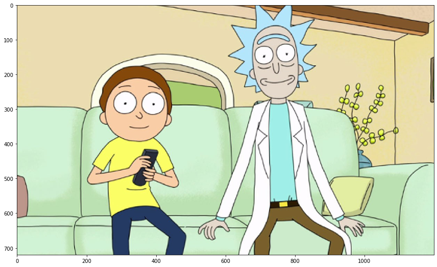

# Mask R-CNN for Object Detection and Segmentation

This is an implementation of Mask R-CNN on Rick and Morty Cartoon Character

# Getting Started
1.Dataset:Collect the Rick and Morty character pictures. I got a lot of images from Kaggle. Refer this https://www.kaggle.com/yoongtran/rick-and-morty-characters to download the dataset

2.Annotation:There is two class , rick and morty. I used VGG Annotation tool. Created an attribute called character and in it gave two ids rick and morty as description.

3.Code:I modified the coco.py file to suit my needs. I have attached my file as character.py

#Training 

Use keras 2.0.8 and tensorflow-gpu 1.15.0 versions.

My dataset had 45+15 pictures.45 for training and 15 for validation

#Results

The results were fine though there is need for more images since there is two classes each class may require atleast 60-100 images.
Overall if you are starting with mask rcnn this is a good way to start.

.png)

.png)

.png)
